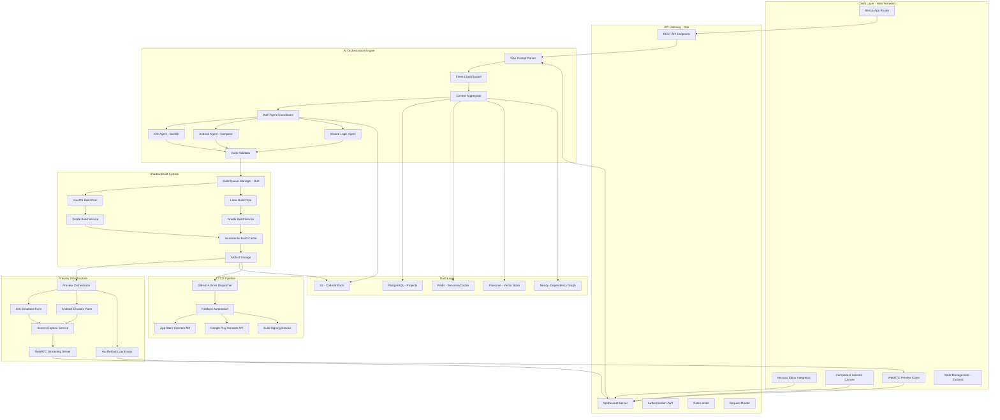
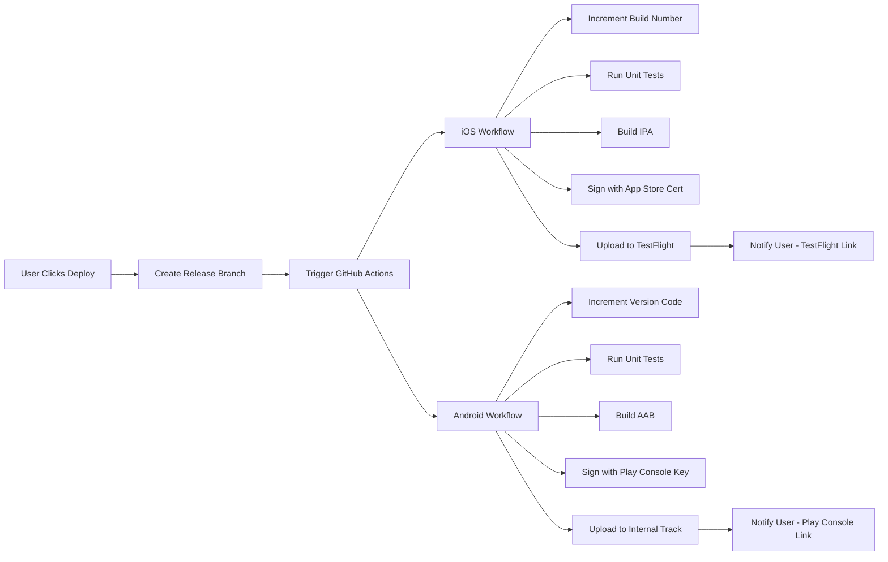

# Vibe Coding Platform: Technical Implementation Plan

## Executive Summary

This document outlines the comprehensive technical architecture for a "Vibe Coding" platform that enables users to build native mobile applications through natural language prompts. The platform generates production-ready Jetpack Compose (Android) and SwiftUI (iOS) code with real-time preview capabilities.

---

## System Architecture



---

## 1. AI Agent Orchestration

### 1.1 Multi-File Context Management

#### Hierarchical Context Architecture

**Three-Tier Context System:**

- **Global Context (20K tokens)**: Project architecture, navigation graph, dependency injection setup, shared models
- **Module Context (12K tokens)**: Feature-specific files (UI, ViewModel, Repository, Use Cases)
- **Local Context (6K tokens)**: Currently edited file plus immediate dependencies

#### Context Aggregation Strategy

**Semantic Code Chunking:**

- Parse each file into Abstract Syntax Tree (AST)
- Extract semantic units: classes, functions, properties, annotations
- Generate embeddings using CodeBERT or similar model
- Store in Pinecone with metadata (file path, type, dependencies)

**Dependency Graph Management:**

- Use Neo4j to maintain real-time dependency relationships
- Track import statements, interface implementations, inheritance
- When AI modifies a file, query affected nodes in graph
- Include affected files in context window for next generation

**Context Retrieval Pipeline:**

1. User submits vibe prompt
2. Prompt analyzer extracts intent and affected components
3. Query vector store for semantically similar code chunks
4. Query dependency graph for related files
5. Assemble hierarchical context based on relevance scores
6. Inject into AI agent prompts with proper token management

### 1.2 Parallel Platform Generation

#### Synchronized Generation Strategy

**Phase 1: Shared Logic Generation**

- Extract business logic requirements from vibe prompt
- Generate platform-agnostic domain models
- Create repository interfaces
- Define use case contracts
- Output shared Kotlin Multiplatform module (if applicable) or separate identical logic

**Phase 2: Parallel UI Generation**

- Feed UI requirements + shared logic to both platform agents
- iOS Agent: Generates SwiftUI views, ViewModels (Combine/Observable)
- Android Agent: Generates Compose screens, ViewModels (StateFlow/ViewModel)
- Both agents receive identical component specification DSL

**Component Specification DSL:**

- Internal representation of UI requirements
- Platform-agnostic description: "Login screen with email field, password field, submit button, forgot password link"
- Each agent translates DSL to platform idioms

**Cross-Platform Functional Equivalence:**

- Maintain mapping table of equivalent components
- Auto-generate snapshot tests for both platforms
- State machine validation: ensure both UIs produce identical state transitions
- API contract testing: verify both platforms make same network calls with same data

#### Agent Coordination Protocol

**Coordinator Responsibilities:**

- Distribute work to platform-specific agents
- Collect generated code from all agents
- Run cross-validation checks
- Resolve conflicts (e.g., different navigation patterns)
- Merge results into unified project structure

**Conflict Resolution:**

- If platform outputs diverge functionally, flag for human review
- Suggest architectural changes to maintain parity
- Provide options: "Android uses BottomNav, iOS uses TabView - proceed or unify?"

---

## 2. Shadow Build Engine

### 2.1 Cloud Build Architecture

#### Build Queue System

**Queue Manager (Bull on Redis):**

- Separate queues for iOS and Android builds
- Priority levels: interactive (high), background (low)
- Job metadata: project ID, changed files, build type (preview/full)
- Retry logic with exponential backoff
- Dead letter queue for failed builds

#### iOS Build Infrastructure

**Challenge:** Xcode requires macOS environment, limiting cloud options

**Solution: Hybrid Approach**

**Option 1: AWS EC2 Mac Instances**

- Provision 10-20 mac2.metal instances
- Install Xcode 15+, configure build agent
- Custom auto-scaling based on queue depth
- Cost: ~$1.08/hour per instance
- Build time target: 45-90 seconds for incremental preview builds

**Option 2: MacStadium Dedicated Servers**

- Lower latency than EC2 Mac
- Better performance for parallel builds
- Fixed monthly cost, better for predictable load

**Option 3: Hybrid GitHub-Hosted + Self-Hosted**

- Use GitHub macOS runners for overflow (6-10 minute queue times acceptable)
- Self-hosted for interactive preview builds (sub-60 second requirement)

**Incremental Build Optimization:**

- Maintain build cache keyed by file content hashes
- Only rebuild changed modules
- Use Xcode's "Build for Previewing" target
- Skip code signing for preview builds
- Cache SwiftUI preview-specific binaries

#### Android Build Infrastructure

**Linux Build Farm:**

- Kubernetes cluster on GKE or EKS
- Pods with pre-configured Gradle + Android SDK
- Horizontal pod autoscaling based on queue metrics
- Build time target: 30-60 seconds for incremental builds

**Gradle Optimization:**

- Enable configuration cache
- Parallel module compilation
- Incremental annotation processing
- Build cache server (self-hosted or Gradle Enterprise)
- Skip unit tests for preview builds
- Use --offline mode with pre-downloaded dependencies

### 2.2 Incremental Build Strategy

**Change Detection:**

- Git-based diffing to identify modified files
- Module dependency analysis to determine rebuild scope
- Skip modules with no transitive dependencies on changed code

**Build Artifact Caching:**

- Store compiled modules in S3 with content-addressable keys
- Cache Gradle build-cache and Xcode DerivedData
- Deduplicate artifacts across projects using same dependencies
- Cache retention: 7 days for preview builds, 30 days for releases

**Build Parallelization:**

- iOS: Use Xcode build system's parallel compilation
- Android: Gradle parallel project execution + worker API
- Both: Run static analysis and linting in parallel with compilation

---

## 3. Live Preview Mechanism

### 3.1 Preview Architecture Comparison

#### Option A: Native Simulators + Screen Streaming (RECOMMENDED)

**Architecture:**

- Run iOS Simulator on macOS instances
- Run Android Emulator on Linux instances with KVM
- Capture screen output via screen recording APIs
- Stream to browser via WebRTC

**Pros:**

- True native preview with 100% fidelity
- Full device capabilities (sensors, gestures)
- No cross-compilation overhead
- Supports all native APIs

**Cons:**

- Higher infrastructure cost
- 100-300ms latency for streaming
- Requires maintained simulator farm

#### Option B: WebAssembly Interpretation (NOT RECOMMENDED)

**Why Not:**

- SwiftUI and Jetpack Compose not designed for WASM
- Would require complete reimplementation of UI frameworks
- Massive engineering effort with limited ROI
- Performance would be inferior to native

#### Option C: Remote Device Farm (HYBRID APPROACH)

**Use Case:**

- Primary: WebRTC streaming from simulators
- Fallback: Physical device farm for final testing
- Integration with AWS Device Farm or BrowserStack

### 3.2 Recommended Implementation

#### Real-Time Preview Pipeline

**Step 1: Build Trigger**

- User changes code via vibe prompt
- Shadow build system compiles app
- Deploys to running simulator instance

**Step 2: Hot Reload**

- Custom hot reload bridge injects code changes
- iOS: Mirror SwiftUI's preview hot reload mechanism
- Android: Use Compose's live literal support
- For structural changes, force app restart (2-3 seconds)

**Step 3: Screen Capture**

- iOS: Use Xcode's simctl screen recording
- Android: Use Android Debug Bridge (ADB) screen capture
- Capture at 30 FPS for smooth interaction
- Encode to H.264 with hardware acceleration

**Step 4: WebRTC Streaming**

- Stream video to browser via WebRTC data channels
- Bidirectional: Send touch events from browser to simulator
- Sub-200ms latency target for interactive feel

#### Hot Reload Bridge Architecture

**iOS Hot Reload:**

- Leverage Xcode's InjectionIII technique
- Swizzle method implementations at runtime
- Reload SwiftUI views without app restart
- Limitations: Can't change app structure or data models

**Android Hot Reload:**

- Use Jetpack Compose's @Preview mechanism
- Live Literals for constant changes
- Gradle's Apply Changes for broader updates
- Full restart for dependency or manifest changes

**Change Classification:**

- **Hot Swappable**: UI colors, text, padding, simple logic
- **Warm Reload**: New UI components, function signatures
- **Cold Restart**: Dependencies, app structure, data models

### 3.3 Component Tagger Implementation

#### Visual Selection System

**Overlay Rendering:**

- During preview, inject accessibility labels with unique IDs
- Render transparent overlay on browser canvas
- Map screen coordinates to component hierarchy

**iOS Implementation:**

- Use UIAccessibility to traverse view hierarchy
- Assign unique tags to each SwiftUI view
- Store mapping: tag -> file path + line number

**Android Implementation:**

- Use Compose semantics tree traversal
- Each composable gets stable semantic ID
- Store mapping: semantic ID -> source location

**User Interaction Flow:**

1. User clicks component in preview
2. Frontend sends coordinate to backend
3. Backend queries simulator's view hierarchy
4. Returns component ID and source location
5. Monaco editor jumps to relevant code
6. AI context includes selected component for next vibe

**Reverse Highlighting:**

- User hovers over code in editor
- Highlight corresponding component in preview
- Implement via WebSocket bidirectional communication

---

## 4. Repository & State Management

### 4.1 Golden Project Template

#### Architectural Pattern

**Clean Architecture with MVVM:**

```
project/
├── android/
│   ├── app/
│   │   ├── src/main/
│   │   │   ├── ui/              # Jetpack Compose screens
│   │   │   │   ├── screens/
│   │   │   │   ├── components/
│   │   │   │   └── theme/
│   │   │   ├── viewmodels/      # Android ViewModels
│   │   │   └── navigation/
│   ├── domain/                   # Shared business logic
│   │   ├── models/
│   │   ├── usecases/
│   │   └── repositories/        # Interfaces only
│   └── data/                     # Repository implementations
│       ├── repositories/
│       ├── datasources/
│       └── api/
│
├── ios/
│   ├── App/
│   │   ├── UI/                  # SwiftUI views
│   │   │   ├── Screens/
│   │   │   ├── Components/
│   │   │   └── Theme/
│   │   ├── ViewModels/          # ObservableObject ViewModels
│   │   └── Navigation/
│   ├── Domain/                   # Shared business logic
│   │   ├── Models/
│   │   ├── UseCases/
│   │   └── Repositories/        # Protocols only
│   └── Data/                     # Repository implementations
│       ├── Repositories/
│       ├── DataSources/
│       └── API/
│
└── shared/                       # Optional KMP module
    ├── commonMain/
    │   ├── domain/
    │   └── data/
    ├── androidMain/
    └── iosMain/
```

#### Mandatory Patterns

**Repository Pattern:**

- All data access through repository interfaces
- Separate local (Room/CoreData) and remote (Retrofit/URLSession) data sources
- Repository coordinates between data sources

**Dependency Injection:**

- Android: Hilt with module organization
- iOS: Swift's native DI or custom container
- AI must generate proper DI setup for new features

**Navigation:**

- Android: Jetpack Navigation Compose with type-safe arguments
- iOS: NavigationStack with Coordinator pattern
- Maintain navigation graph in AI context

**State Management:**

- Android: StateFlow for UI state, SharedFlow for events
- iOS: @Published properties, Combine publishers
- Unidirectional data flow (MVI-inspired)

### 4.2 AI Code Generation Constraints

**Enforced Rules:**

1. **Never bypass repositories**: Direct API calls forbidden
2. **Single Responsibility**: Each ViewModel manages one screen
3. **Immutable State**: All state objects are data classes/structs
4. **Error Handling**: Sealed classes (Android) / Enums (iOS) for Result types
5. **Testing**: Generate unit tests for ViewModels and UseCases
6. **Accessibility**: All UI components must have semantic labels

**Code Quality Gates:**

- Run Detekt (Android) and SwiftLint (iOS) on generated code
- Enforce 80% test coverage for business logic
- Reject code with cyclomatic complexity > 10
- Validate architecture compliance via custom linter rules

### 4.3 Project State Synchronization

**Database Schema (PostgreSQL):**

- `projects` table: project metadata, owner, platform targets
- `files` table: file path, content hash, last modified
- `dependencies` table: package/framework versions
- `build_artifacts` table: build outputs, preview URLs
- `vibe_history` table: user prompts, generated code, rollback points

**Real-Time Sync:**

- WebSocket updates for collaborative editing
- Operational Transform (OT) for conflict resolution
- Periodic snapshots to S3 for disaster recovery

---

## 5. Deployment Pipeline

### 5.1 CI/CD Architecture



### 5.2 Automated Release Flow

#### Pre-Deployment Checks

**Quality Gates:**

- All unit tests pass (90%+ coverage)
- No critical static analysis issues
- Accessibility audit passes
- Performance benchmarks meet thresholds
- Security scan passes (no hardcoded secrets, vulnerable dependencies)

#### iOS Deployment

**Fastlane Configuration:**

- `increment_build_number`: Auto-increment based on git commit count
- `run_tests`: Execute XCTest suite
- `build_app`: Xcode build with App Store provisioning
- `upload_to_testflight`: API upload with release notes
- `submit_for_review`: Optional auto-submission after testing period

**App Store Connect Integration:**

- Store credentials in GitHub Secrets
- Use App Store Connect API key (not username/password)
- Auto-generate release notes from git commits
- Set testing groups for staged rollout

#### Android Deployment

**Fastlane Configuration:**

- `increment_version_code`: Based on previous Play Console version
- `gradle`: Build release AAB with R8 optimization
- `sign_apk`: Sign with upload key from GitHub Secrets
- `upload_to_play_store`: Upload to internal track
- `promote_track`: Manual promotion to alpha/beta/production

**Play Console Integration:**

- Service account JSON key stored securely
- Automated screenshot generation from Compose UI tests
- Release notes from `CHANGELOG.md`
- Staged rollout: 10% -> 50% -> 100%

### 5.3 Build Signing & Security

**Certificate Management:**

- iOS: Store distribution certificate and provisioning profiles in encrypted GitHub Secrets
- Android: Store keystore file and passwords in secrets
- Rotate signing keys annually
- Use separate keys for preview vs production builds

**Continuous Monitoring:**

- Crashlytics integration for crash reporting
- Analytics hooks for user behavior tracking
- Performance monitoring (Firebase Performance/Datadog)
- Automated rollback if crash rate > 2%

---

## Tech Stack Specification

### Frontend Stack

| Component | Technology | Justification |
|-----------|------------|---------------|
| Framework | Next.js 14 (App Router) | SSR for SEO, React Server Components for performance |
| UI Library | Radix UI + Tailwind CSS | Accessible primitives, rapid styling |
| Code Editor | Monaco Editor | VSCode-quality editing in browser |
| State Management | Zustand | Lightweight, minimal boilerplate |
| Real-Time | Socket.io Client | WebSocket abstraction with fallbacks |
| Video Streaming | WebRTC via simple-peer | Low-latency preview streaming |
| Build Tool | Turbopack | Faster than Webpack for dev builds |
| Deployment | Vercel | Native Next.js hosting, edge functions |

### Backend Stack

| Component | Technology | Justification |
|-----------|------------|---------------|
| Framework | Ktor (Kotlin) | Lightweight, coroutine-based, type-safe |
| API Layer | Ktor Resources + Content Negotiation | Type-safe routing, automatic serialization |
| WebSocket | Ktor WebSockets | Native support, scales with coroutines |
| Authentication | Ktor Auth JWT | Stateless auth, integrates with OAuth providers |
| Validation | Ktor RequestValidation | Input sanitization, schema validation |
| ORM | Exposed (Kotlin SQL) | Type-safe SQL, integrates with coroutines |
| HTTP Client | Ktor Client | For external API calls (Claude API, GitHub) |
| Serialization | kotlinx.serialization | Fast, compile-time safe JSON |
| Deployment | GKE (Google Kubernetes Engine) | Auto-scaling, multi-region support |

### AI Orchestration

| Component | Technology | Justification |
|-----------|------------|---------------|
| Primary LLM | Claude 3.5 Sonnet (Anthropic) | Superior code generation, large context window |
| Code Analysis | Tree-sitter | Language-agnostic AST parsing |
| Embeddings | CodeBERT | Specialized for code semantic similarity |
| Vector Store | Pinecone | Managed, low-latency similarity search |
| Graph Database | Neo4j | Track code dependencies and relationships |
| Prompt Templates | LangChain (Kotlin port) | Structured prompt management |

### Cloud Infrastructure

| Component | Technology | Justification |
|-----------|------------|---------------|
| Container Orchestration | Kubernetes (GKE) | Industry standard, robust scaling |
| iOS Build Runners | AWS EC2 Mac instances | Only cloud option for macOS at scale |
| Android Build Runners | GKE with GPU nodes | Fast emulator performance with KVM |
| Object Storage | AWS S3 + CloudFront CDN | Code artifacts, build outputs |
| Database | PostgreSQL (Cloud SQL) | ACID compliance, JSON support |
| Cache | Redis (Memorystore) | Session storage, build queue |
| Message Queue | Redis + Bull | Reliable job processing |
| Monitoring | Datadog | Unified metrics, logs, APM |
| CI/CD | GitHub Actions | Native GitHub integration |
| Secret Management | Google Secret Manager | Secure credential storage |

### Mobile Build Tools

| Component | Technology | Justification |
|-----------|------------|---------------|
| iOS Build | Xcode 15+ | Required for iOS compilation |
| Android Build | Gradle 8+ | Modern build system with caching |
| Automation | Fastlane | Cross-platform deployment automation |
| Testing | XCTest (iOS), JUnit (Android) | Native testing frameworks |
| Static Analysis | SwiftLint, Detekt | Enforce code quality |
| Crash Reporting | Firebase Crashlytics | Real-time crash monitoring |

---

## Critical Bottlenecks & Mitigation Strategies

### Bottleneck 1: iOS Build Time & Infrastructure Cost

**Problem:**

- macOS instances are expensive (~$1.08/hr for EC2 Mac)
- Xcode builds take 2-5 minutes for full compilation
- Limited cloud options for macOS infrastructure
- User expects sub-60 second preview updates

**Impact:**

- High operational cost ($10K-50K/month for 10-20 instances)
- Poor user experience if build takes >90 seconds
- Scaling challenges during peak usage

**Mitigation Strategies:**

**Strategy 1: Aggressive Incremental Builds**

- Implement module-level caching with content-addressable storage
- Only rebuild changed SwiftUI views, not entire app
- Use Xcode's "Build for Previewing" which skips optimization passes
- Maintain hot pool of pre-built base projects per template
- Target: 30-45 second incremental builds for UI-only changes

**Strategy 2: Hybrid Cloud Approach**

- Dedicated EC2 Mac instances (5-10) for interactive preview builds
- GitHub Actions macOS runners for background/full builds
- MacStadium for cost-effective baseline capacity
- Auto-scale EC2 Mac based on queue depth metrics
- Expected cost reduction: 40-60%

**Strategy 3: Preview-Specific Optimization**

- Skip code signing for preview builds
- Disable bitcode and optimization
- Use simulator-only builds (no device support needed)
- Lazy load frameworks (don't link until needed)
- Target: Reduce build artifact size by 70%

**Strategy 4: Build Prediction & Pre-Warming**

- ML model predicts likely next user changes based on vibe history
- Pre-compile common components speculatively
- Maintain build cache for popular UI patterns
- Warm up build environment before user submits next vibe

**Expected Outcome:**

- 50% reduction in average build time
- 40% reduction in infrastructure cost
- 95th percentile build time < 90 seconds

---

### Bottleneck 2: Context Window Management for Large Projects

**Problem:**

- Claude 3.5 Sonnet has 200K token context limit
- Typical mobile app has 50-200 files (500K-2M tokens if all included)
- AI needs context of related files to generate coherent code
- Including too much context reduces output quality
- Including too little context breaks architectural consistency

**Impact:**

- AI generates code that conflicts with existing architecture
- Missing imports or incorrect function signatures
- Inconsistent naming conventions across files
- Poor developer experience with "broken" generated code

**Mitigation Strategies:**

**Strategy 1: Intelligent Context Pruning**

- Semantic search via embeddings to find only relevant code
- Dependency graph traversal to include only affected files
- Summarize unchanged files (50 tokens instead of 500)
- Use tree-shaking approach: include declarations but not implementations
- Target: Reduce context size by 80% while maintaining quality

**Strategy 2: Hierarchical Context Assembly**

- Level 1: Project architecture (navigation, DI, core models) - 10K tokens
- Level 2: Current feature module (UI, ViewModel, Repository) - 20K tokens
- Level 3: Specific file being edited + direct dependencies - 15K tokens
- Total: 45K tokens, leaving 155K for AI response

**Strategy 3: Multi-Turn Agentic Workflow**

- Break complex changes into subtasks
- First turn: Generate domain models and repository interfaces
- Second turn: Generate ViewModels using previous output as context
- Third turn: Generate UI screens using ViewModels
- Each turn has fresh context budget

**Strategy 4: Template-Based Code Skeletons**

- Store common patterns as templates (100 tokens vs 1000)
- Reference templates instead of including full code
- AI fills in template parameters rather than generating from scratch
- Examples: "LoginScreen template", "PaginatedList template"

**Strategy 5: Project-Specific Knowledge Base**

- Create project-specific embedding index during onboarding
- Include architectural decision records (ADRs)
- Store common patterns and conventions
- Retrieve during generation to maintain consistency

**Expected Outcome:**

- 90% of generations stay within 50K token context budget
- Architectural consistency score: 95%+
- Reduced hallucination rate by 70%

---

### Bottleneck 3: Real-Time Preview Latency

**Problem:**

- Round-trip latency: Code change → Build → Deploy → Stream → Browser
- Target: <3 seconds for perceived "instant" feedback
- Current baseline: 5-10 seconds for full cycle
- Network latency adds 100-300ms for video streaming
- User frustration if feedback loop too slow

**Impact:**

- Poor user experience, abandonment
- Platform feels sluggish compared to web-based tools
- Difficult to iterate quickly on UI tweaks

**Mitigation Strategies:**

**Strategy 1: Optimistic UI Updates**

- Frontend immediately renders AI's proposed code changes
- Show "preview" badge until real build completes
- If build fails, revert to last known good state
- User perceives instant feedback (0-100ms)

**Strategy 2: Hot Reload for UI-Only Changes**

- Classify changes: structural vs cosmetic
- Cosmetic changes (colors, text, padding): hot reload in 500ms
- Structural changes (new screens, navigation): warm reload in 2-3s
- Data model changes: cold restart in 5-10s
- Target: 80% of changes are hot-reloadable

**Strategy 3: Predictive Pre-Building**

- Analyze user's vibe prompt before they submit
- Start build process during typing (debounced)
- By time user hits "Generate", build is 50-80% complete
- Perceived latency: 1-2 seconds instead of 5-10 seconds

**Strategy 4: Regional Build Clusters**

- Deploy build infrastructure in 3-5 regions globally
- Route users to nearest build cluster
- Reduce network latency by 40-60%
- Use CloudFront edge locations for artifact delivery

**Strategy 5: Progressive Preview Loading**

- Stream build progress to frontend
- Show compilation logs in real-time
- Display partial UI as it renders
- Engage user with feedback during wait time

**Strategy 6: Client-Side Simulation (Hybrid)**

- For simple Compose/SwiftUI changes, run interpretation in browser
- Use lightweight runtime that approximates native rendering
- Show approximate preview in <500ms
- Background: Real build completes for accurate preview
- Automatically swap when ready

**Expected Outcome:**

- Perceived latency: <1 second for 80% of changes
- Actual latency: <3 seconds for 95% of changes
- User satisfaction score: 4.5/5 or higher

---

## Implementation Roadmap

### Phase 1: MVP (Months 1-3)

**Core Features:**

- Basic web IDE with Monaco editor
- Single-file code generation (one screen at a time)
- Android-only support (faster iteration)
- Manual build trigger (no real-time preview yet)
- Simple file tree navigation
- Text-based code output (no streaming)

**Infrastructure:**

- Ktor backend on single GKE cluster
- PostgreSQL database for project storage
- S3 for code artifacts
- Claude API integration with basic prompts
- GitHub Actions for Android builds

**Success Metrics:**

- Generate functionally correct Compose screen from prompt
- Build completes in <2 minutes
- 10 beta users successfully create simple apps

### Phase 2: Enhanced Generation (Months 4-6)

**Core Features:**

- Multi-file context management
- Full project generation (app with 5-10 screens)
- iOS support (SwiftUI + Android in parallel)
- Dependency graph tracking
- Code refactoring capabilities
- Vector-based semantic search

**Infrastructure:**

- Pinecone for embeddings
- Neo4j for dependency graph
- EC2 Mac instances for iOS builds
- Redis queue system for build management

**Success Metrics:**

- Generate complete login + dashboard + settings flow
- iOS and Android achieve functional parity
- Context retrieval accuracy: 90%+

### Phase 3: Live Preview (Months 7-9)

**Core Features:**

- Real-time device preview in browser
- WebRTC streaming from simulators
- Component tagger for visual selection
- Hot reload for UI changes
- Build optimization for <60s turnaround

**Infrastructure:**

- Simulator farm (iOS + Android)
- WebRTC signaling server
- Incremental build caching
- CDN for artifact delivery

**Success Metrics:**

- Preview latency: <3 seconds (P95)
- Hot reload success rate: 80%+
- User can visually select and edit components

### Phase 4: Production Ready (Months 10-12)

**Core Features:**

- Automated deployment to TestFlight/Play Store
- Team collaboration features
- Version control integration
- Advanced code quality gates
- Template marketplace
- Analytics and monitoring

**Infrastructure:**

- Multi-region deployment
- Production-grade monitoring (Datadog)
- Disaster recovery procedures
- Security hardening and compliance

**Success Metrics:**

- 100+ paying customers
- 500+ apps deployed to stores
- 99.9% uptime SLA
- Net Promoter Score: 50+

---

## Security & Compliance Considerations

### Data Protection

- Encrypt all user code at rest (AES-256)
- Encrypt in transit (TLS 1.3)
- Isolate build environments per project
- Automatic credential rotation every 90 days

### Access Control

- Role-based access control (RBAC) for team features
- OAuth 2.0 integration (Google, GitHub, Apple)
- Two-factor authentication for deployments
- Audit logging for all code changes

### Compliance

- GDPR compliance for EU users
- SOC 2 Type II certification (year 2)
- Regular penetration testing
- Dependency vulnerability scanning (Snyk)

---

## Cost Projection (Monthly)

### Infrastructure (Assuming 1000 Active Projects)

| Resource | Quantity | Unit Cost | Total |
|----------|----------|-----------|-------|
| EC2 Mac Instances | 10 instances | $780/mo | $7,800 |
| GKE Cluster (Android builds) | 20 nodes | $150/mo | $3,000 |
| PostgreSQL (Cloud SQL) | 1 instance | $200/mo | $200 |
| Redis (Memorystore) | 2 instances | $100/mo | $200 |
| S3 Storage + Transfer | 5TB | $150 | $750 |
| Pinecone (Vector DB) | 100M vectors | $70 | $70 |
| Claude API Calls | 50M tokens/day | $15/M tokens | $22,500 |
| Monitoring (Datadog) | 50 hosts | $15/host | $750 |
| **Total** | | | **$35,270/mo** |

### Revenue Model

- Free tier: 5 vibes/day, watermarked previews
- Pro tier: $49/month - unlimited vibes, deployments
- Team tier: $199/month - collaboration features
- Enterprise: Custom pricing

**Break-even:** ~720 Pro subscribers or 180 Team subscriptions

---

## Success Metrics & KPIs

### Technical Performance

- Build success rate: >95%
- Preview latency (P95): <3 seconds
- Code quality score: >85/100 (static analysis)
- Architectural consistency: >90%
- Uptime SLA: 99.9%

### User Experience

- Time to first working app: <10 minutes
- User satisfaction (NPS): >40
- Daily active users: >500 (by month 12)
- Vibe-to-deploy ratio: >30% (users who deploy)

### Business

- Monthly Recurring Revenue: $50K (by month 12)
- Customer acquisition cost: <$100
- Churn rate: <5% monthly
- App Store approval rate: >80%

---

## Conclusion

This technical implementation plan provides a comprehensive roadmap for building a production-grade "Vibe Coding" platform for native mobile development. The architecture balances user experience (real-time feedback), technical feasibility (native code generation), and business viability (manageable infrastructure costs).

**Key Success Factors:**

1. **Aggressive build optimization** to achieve sub-60 second preview cycles
2. **Intelligent context management** to maintain code quality at scale
3. **Robust AI orchestration** to ensure cross-platform functional parity
4. **Seamless preview experience** via WebRTC streaming and hot reload
5. **Production-ready deployment** with automated CI/CD to app stores

The most critical bottlenecks—iOS build infrastructure, context management, and preview latency—have clear mitigation strategies that can reduce their impact by 40-80%.

By following this phased implementation roadmap, the platform can reach MVP in 3 months and production-ready state within 12 months, with a clear path to profitability.
